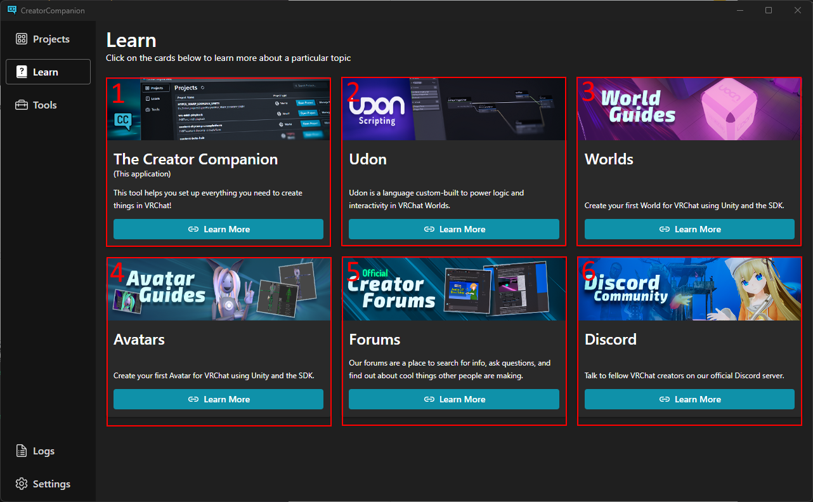

So this section where you could learn more about making content on VRChat. It's broken up into 6 sections. Each of these section has a link that lead you to where you can learn more about each section

1. This section allow you to learn more about the VRChat Creator Companion App.

2. This section allow you to learn more about Udon, the game's programming language

3. This section allow you to learn how to create your first world.

4. This section allow you to learn how to create your first avatar.

5. This section leads to the VRChat forums where you can get official announcements on VRChat, Discuss about VRChat, Udon, Avatars and so much more

6. This leads you to the Official VRChat Discord.
