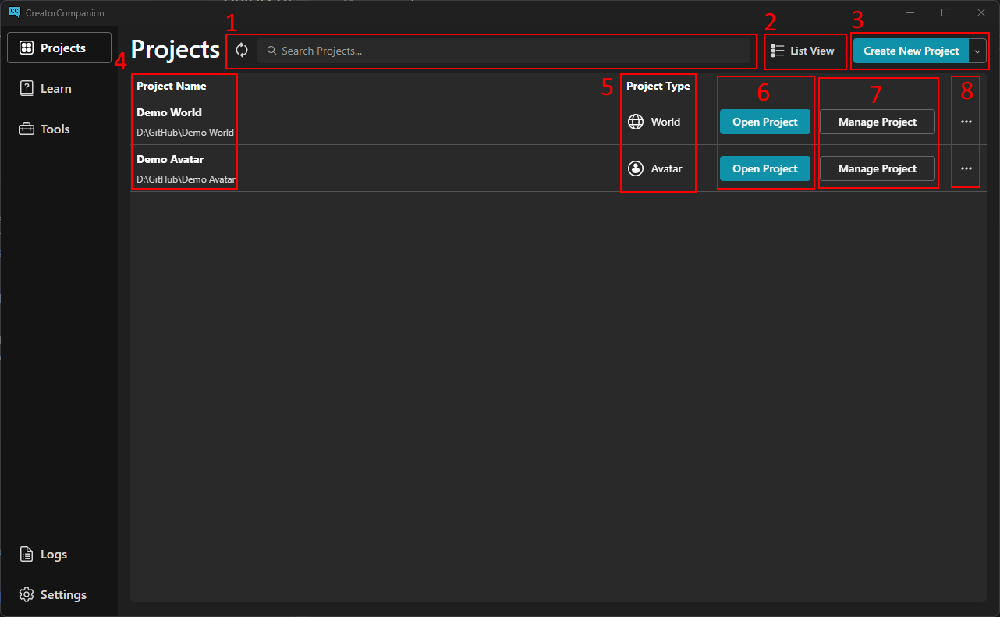

This Section is where all of your avatar and world projects are shown.

It can be broken down into 8 sections. They Included

1. Search and Refresh Bar
2. View Project
3. Create/Add Existing Project
4. Project's Name and its file location 
5. Project Type (World/Avatar)
6. Open Project
7. Manage Project
8. Additional Project Options

## Search and Refresh Bar

---

##  View Project

---

## Create/Add Existing Project

---

## Project's Name and it's file location
