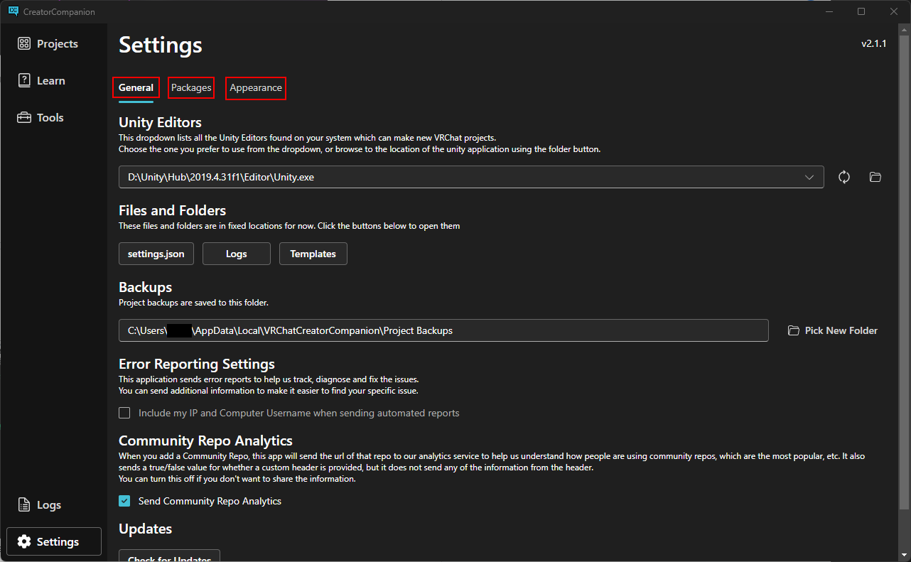

Here is where you can make changes to your Creator Companion App.
It can be broken up into three sections. General, Packages and Appearance.

# General

So General settings is broken up into 6 sections: Unity Editor, Files and Folders, Backups, Error Reporting Settings, Community Repo Analytics and Update.

## Unity Editor

---

The Unity Editor is tells the VRChat Companion App which version of the Unity editor to use, as of this writing its default to the current version that VRChat is using 2019.31.f1.

## Files and Folders

---

These direct you to where the settings.json, Logs and Templates the Companion app uses are stored.

## Backups

---

This is where all of your back up projects for all of your vrchat projects will be at.

## Error Reporting Settings

---

This setting give you control on what information is sent to VRChat to help the VRChat team track, diagnose and fix issues with your projects. The default settings does not add your IP and Computer username to the automatic reports

## Community Repo Analytics

---

This allows VRChat to receive analytics on which community repos are used for your project to analyse which community repos are the most populars.

## Updates

---

This checks to see if you are using the latest version of the creator companion app.

## Packages

---

The package settings is where you can make changes related to your packages. It is broken up into 3 sections: **Installed Repositories, Pre-Release Packages, and User Packages**.

## Installed Repositories

---

The Creator Companion App comes with installed Repositires which included **Official, Curated and Local User Packages**

The Official ones includes:

- VRChat Package Resolver Tool
- VRChat SDK - Base
- VRChat SDK - Avatars
- VRChat SDK - Worlds

The Curated Packages are packages that the VRC Team that curated. The curated projects include:

- Gesture Manager
- Avatar 3.0 Manager
- East Quest Switch
- VRWorld Tool Kit
- AudioLink

Local User Packages are packages that you have on your computer.

## Pre-Release Packages

---

These are packages that added new features, they are usually come along in the open beta. By default, they are hidden but you can toggle them by clicking the check mark box.

## User Packages

---

Here you can add your own packages to the list to easily include them in your projects.

# Appearance

Here you can change the appearance of your Companion App. You can set it to what your system is set to or you can set it light/dark mode.